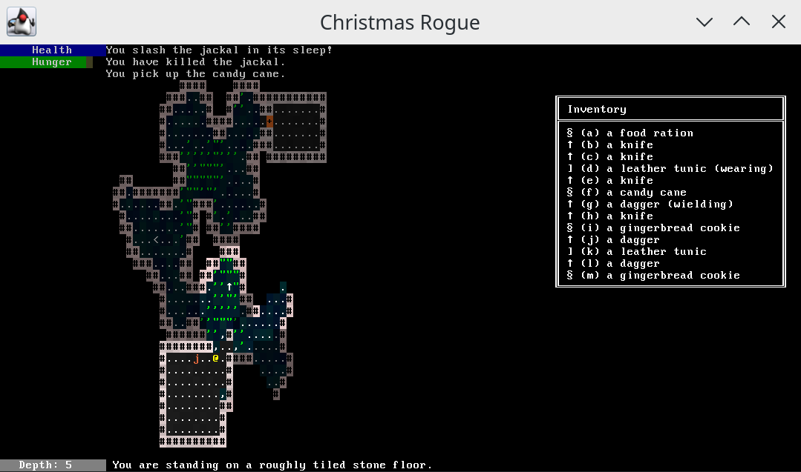

# Christmas Rogue

Probably the most over-the-top Christmas present I will ever produce.
Created in December 2014 for my father.

## Some useful information...

### Movement

    left    move west
    right   move east
    up      move north
    down    move south

    H       move west
    J       move south
    K       move north
    L       move east
    Y       move northwest
    U       move northeast
    B       move southwest
    N       move southeast

    1       move southwest
    2       move south
    3       move southeast
    4       move west
    6       move east
    7       move northwest
    8       move north
    9       move northeast

    .       rest \
    Z       rest |- allow monsters to move

* You cannot move diagonally with the arrow keys. If you want to move
  with the arrow keys, mix in 1379 or YUBN when you need to move
  diagonally.
* You can only move through tiles you can see through, and doors.
* You can move diagonally around corners, even through a door.

## Combat

* If you attempt to move into a cell containing a monster, you will
  attack it.
* Monsters are initially asleep. If they don't wake up before you get
  to them, your first attack will do more damage.
* If there is one cell between you and a monster, it is advisable to
  wait a turn so that the monster will walk next to you, where you can
  attack first. (Unless, of course, it is still asleep, in which case
  you have the option of trying to sneak up on it the rest of the
  way.)

* Your current health and hunger are shown in the top-left corner of
  the screen.
* You will naturally regenerate health if you are not in combat. If
  you stand still, this will occur faster.

## Inventory

* If you move into a cell containing an item, you will pick it up,
  unless you have no room in your inventory.
* Make sure to eat occasionally, but don't eat when you are full or
  you will waste food.

Keys:

    escape  Dismiss inventory screen
    [a-z]   Select item on inventory screen
    i       Show inventory
    d       Drop item
    e       Wield, wear, or eat item
    r       Unwield or remove item

## Dungeon

    <       climb a staircase
    >       descend a staircase

* Your current depth (1-26) and a description of the tile you are
  standing on are shown at the bottom of the screen.

Symbols:

    You:                    @
    Background tiles:       .,'"+<>
    Wall tiles:             #
    Items:                  §↑]
    Charming inhabitants:   bBDefgGhjkmnOrSTVWZ:&
